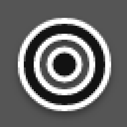

# Animated Dot Cursors

A minimal dot and ring cursor theme designed from scratch for reversible
cursor transitions in a patched Niri. Unpatched compositors and X11
applications see an ordinary Xcursor theme.

| | | |
| --- | --- | --- |
| **Arrow / Link**<br> | **Arrow / Text**<br> | **Link / Text**<br> |
| **Arrow / Horizontal resize**<br> | **Arrow / Vertical resize**<br> | **Arrow / NE-SW resize**<br> |
| **Arrow / NW-SE resize**<br> | **Arrow / Column resize**<br> | **Arrow / Grab**<br> |
| **Grab / Grabbing**<br> | **Arrow / Grabbing**<br> | **Arrow / Progress**<br> |
| **Arrow / Wait**<br> | **Grabbing / Copy**<br> | **Grabbing / Not allowed**<br> |
| **Grabbing / No drop**<br> | **Arrow / Crosshair**<br> | **Text / Vertical text**<br> |
| **Zoom in / Zoom out**<br> | | |

Previews play slowed down with pauses at the endpoints; real transitions last
120 ms (24 frames at 5 ms).

## Design

Cursors are not drawn as images. Each one is a list of keyed parts in
`src/rig.rs`, in design units on a 32x32 grid centered on the hotspot:

- **bar**: a round-capped stadium; equal length and width make a dot.
- **chevron**: an open arrowhead.
- **arc**: a stroked arc or full ring.

A transition interpolates the parameters of parts that share a key, so the
dot stretches into the text bar, the text bar rotates into vertical text, and
the palm becomes the not-allowed slash. A part present on only one side grows
from an anchor (resize arrows slide out of the dot, fingers out of the palm),
ripples in from a wider ring, or spirals out while sweeping open (spinners).
Leaving parts finish in the first three quarters of a transition and entering
parts start a quarter in, mirrored so that a transition played backwards is
exactly the opposite transition. Tests check this property for every
pair of shapes.

Every part is a stroked centerline. The white border is the same geometry
stroked wider, so overlapping parts merge into one outline. The shadow is
the blurred border. All hotspots are at the shape center.

## Build

```sh
nix build                              # theme in result/share/icons
nix build .#niri --out-link result-niri  # patched Niri 26.04
```

Locally:

```sh
nix develop
cargo test
cargo run --release -- --output build/animated_dot_cursors --preview previews
```

The generator writes Xcursor files directly at nominal sizes 24 to 64 in
steps of 8. The whole theme takes a few seconds.

## Niri

Apply `patches/niri-cursor-transitions.patch` to Niri 26.04, then set the
theme with Home Manager's `home.pointerCursor` and in Niri:

```kdl
cursor {
    xcursor-theme "animated_dot_cursors"
    xcursor-size 24
}
```

A transition is an ordinary animated Xcursor file named
`cursors/<from>-to-<to>` with Wayland cursor-shape names. One file serves
both directions. Shape aliases (such as `e-resize` or `move`) share files
through symlinks. Only applications that use the cursor-shape protocol get
transitions.
