# Animated Cursors

Parametric Xcursor themes designed for reversible cursor transitions in a
patched Niri. Every cursor is drawn from code, so transitions interpolate the
design itself rather than cross-fading images. Unpatched compositors and X11
applications see ordinary (animated) Xcursor themes.

Each theme section below previews every cursor and transition at 64 px
nominal size. Idle loops play in real time after their rest; transitions are
slowed and play both ways with pauses at the ends (the real ones last 120 ms).

## Themes

### Shapes (`animated_shapes_cursors`)

Material 3 Expressive inspired. Every cursor is a shape from the M3 shape
library (rounded polygons, cookies, clovers, sunny and soft-burst stars,
flowers, pills) in its own vivid color, with white glyphs:

| Cursor | Shape | Color |
| --- | --- | --- |
| Arrow | Rounded triangle, tip on the hotspot | Violet |
| Link | Four-leaf clover with a center dot | Coral |
| Text, vertical text | Pill | Indigo |
| Resize | Pill with chevrons; column resize is a rounded square | Teal |
| Grab, grabbing | Open 8-petal bloom that closes into a tight cookie | Sky, navy |
| Copy | Flower with a plus | Green |
| Not allowed, no drop | Octagon with a bar; closed bloom with a ban sign | Red |
| Progress, wait | Loading indicator cycling square, triangle, hexagon, pill, pentagon, diamond and circle, each in its own color | Multi |
| Crosshair | Four triangles around a dot | Charcoal |
| Zoom | Sunny and 12-sided cookie with plus and minus | Magenta |

Each cursor rests for 1 to 2 seconds, then plays a short springy idle gesture:
the arrow nods about its tip, the clover, bloom, flower and zoom shapes twirl
by one of their symmetries (so the loop closes seamlessly), resize chevrons
nudge outward, grabbing squeezes, no-drop and not-allowed shake, and the
crosshair pulses. Busy cursors loop the loading indicator instead, one shape
every 0.7 seconds.

Every cursor clicks at the arrow tip, and every shape sits centered on the
arrow body, so morphs happen in place. For centered shapes such as the
clover, pill or octagon, the click point is at their upper left.

Shapes are polar outlines (radii at evenly spaced angles), so any two morph
by interpolating radii. Transitions spring with a slight overshoot and twist,
sweep color through OKLab, morph glyphs that share a key, and pop the rest in
or out.


#### Cursors

| | | | | |
| --- | --- | --- | --- | --- |
| 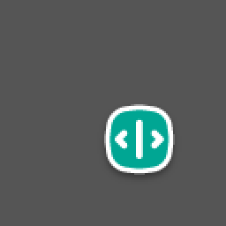<br><sub>col-resize</sub> | <br><sub>copy</sub> | 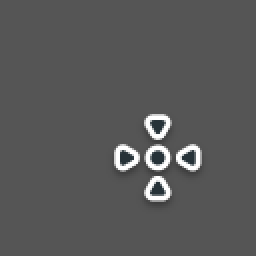<br><sub>crosshair</sub> | 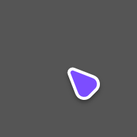<br><sub>default</sub> | <br><sub>ew-resize</sub> |
| 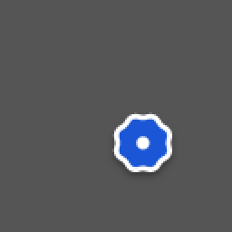<br><sub>grabbing</sub> | <br><sub>grab</sub> | 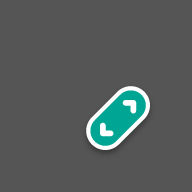<br><sub>nesw-resize</sub> | 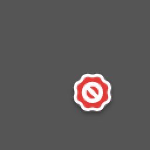<br><sub>no-drop</sub> | <br><sub>not-allowed</sub> |
| 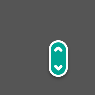<br><sub>ns-resize</sub> | <br><sub>nwse-resize</sub> | 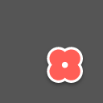<br><sub>pointer</sub> | 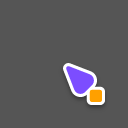<br><sub>progress</sub> | 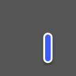<br><sub>text</sub> |
| 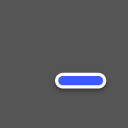<br><sub>vertical-text</sub> | 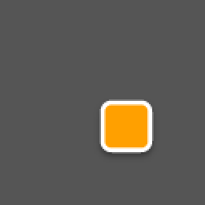<br><sub>wait</sub> | 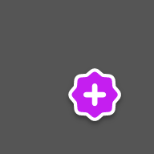<br><sub>zoom-in</sub> | 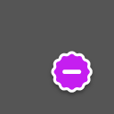<br><sub>zoom-out</sub> | |

#### Transitions

| | | | | |
| --- | --- | --- | --- | --- |
| 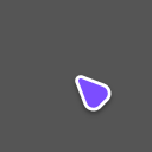<br><sub>default / col-resize</sub> | 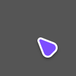<br><sub>default / crosshair</sub> | <br><sub>default / ew-resize</sub> | <br><sub>default / grabbing</sub> | <br><sub>default / grab</sub> |
| <br><sub>default / nesw-resize</sub> | <br><sub>default / ns-resize</sub> | <br><sub>default / nwse-resize</sub> | <br><sub>default / pointer</sub> | <br><sub>default / progress</sub> |
| <br><sub>default / text</sub> | <br><sub>default / wait</sub> | 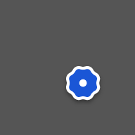<br><sub>grabbing / copy</sub> | <br><sub>grabbing / no-drop</sub> | <br><sub>grabbing / not-allowed</sub> |
| <br><sub>grab / grabbing</sub> | <br><sub>pointer / text</sub> | <br><sub>text / vertical-text</sub> | <br><sub>zoom-in / zoom-out</sub> | |

### Dot (`animated_dot_cursors`)

Minimal dots and rings built from keyed bars, chevrons and arcs. Shared parts
stretch, slide and rotate between shapes; parts present on one side grow from
an anchor, ripple in, or spiral out. A transition played backwards is exactly
the opposite transition, which the tests check for every pair.

Idle loops rest, then play a small gesture: the dot beats twice, the fingertip
pointer taps, carets breathe, resize chevrons nudge, fingers lift off the palm
one by one, the fist squeezes, badges spin or shake, the not-allowed slash
flips end over end, crosshair ticks pulse inward, and the zoom glyph turns.


#### Cursors

| | | | | |
| --- | --- | --- | --- | --- |
| 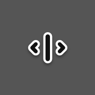<br><sub>col-resize</sub> | <br><sub>copy</sub> | 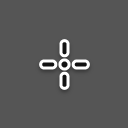<br><sub>crosshair</sub> | 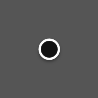<br><sub>default</sub> | <br><sub>ew-resize</sub> |
| 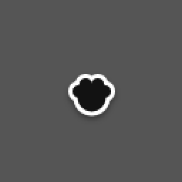<br><sub>grabbing</sub> | <br><sub>grab</sub> | <br><sub>nesw-resize</sub> | 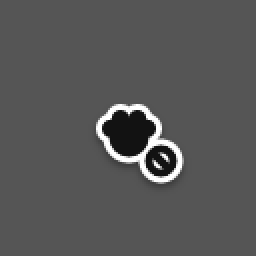<br><sub>no-drop</sub> | <br><sub>not-allowed</sub> |
| <br><sub>ns-resize</sub> | <br><sub>nwse-resize</sub> | 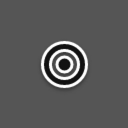<br><sub>pointer</sub> | <br><sub>progress</sub> | 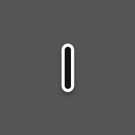<br><sub>text</sub> |
| 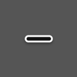<br><sub>vertical-text</sub> | <br><sub>wait</sub> | <br><sub>zoom-in</sub> | <br><sub>zoom-out</sub> | |

#### Transitions

| | | | | |
| --- | --- | --- | --- | --- |
| 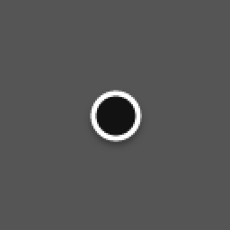<br><sub>default / col-resize</sub> | <br><sub>default / crosshair</sub> | <br><sub>default / ew-resize</sub> | <br><sub>default / grabbing</sub> | <br><sub>default / grab</sub> |
| <br><sub>default / nesw-resize</sub> | <br><sub>default / ns-resize</sub> | <br><sub>default / nwse-resize</sub> | <br><sub>default / pointer</sub> | <br><sub>default / progress</sub> |
| <br><sub>default / text</sub> | <br><sub>default / wait</sub> | <br><sub>grabbing / copy</sub> | <br><sub>grabbing / no-drop</sub> | <br><sub>grabbing / not-allowed</sub> |
| <br><sub>grab / grabbing</sub> | 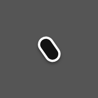<br><sub>pointer / text</sub> | <br><sub>text / vertical-text</sub> | <br><sub>zoom-in / zoom-out</sub> | |

### Fluid (`animated_fluid_cursors`)

Liquid metaballs. Every cursor is a few drops (circles, capsules and round
cones) summed into one distance field through an exponential smooth union, so
nearby drops melt together with soft necks. Carved drops cut white glyphs out
of the liquid, and inlaid drops refill holes, as in the zoom lens and the ban
sign. Each cursor has its own color, and where differently colored drops meet,
their colors blend:

| Cursor | Drops | Color |
| --- | --- | --- |
| Arrow | Teardrop, tip on the hotspot | Blue |
| Link | Upright teardrop with a carved hole | Coral |
| Text, vertical text | Stem melting into two serifs | Indigo |
| Resize | Bar with chevron arrowheads | Teal |
| Grab, grabbing | Palm with a thumb and three fingers that pull in to knuckles | Sky, navy |
| Copy, no drop | Fist with a badge drop carved with a plus or a slash | Green, red |
| Not allowed | Ring with an inlaid slash | Red |
| Progress | Teardrop with two drops circling its belly | Blue, amber, coral |
| Wait | Core with three orbiting drops | Violet, magenta, amber, teal |
| Crosshair | Dot and four ticks | Charcoal |
| Zoom | Lens ring with an inlaid plus or minus, and a handle | Magenta |

Drops sharing a key flow into each other while the union gets briefly gooier
mid-transition. Drops present on one side bud out of an anchor or melt back
into it, with their border shrinking along with them. A transition played
backwards is exactly the opposite transition, which the tests check for every
pair.

Idle loops rest, then play a liquid gesture: a drip sags from the arrow and
springs back with a jiggle, the link drop taps, a bead runs down the text
stem, arrowheads pull off the resize bar, fingers stretch one after another,
the fist squeezes, the copy badge tugs away while its plus turns, the no-drop
badge shakes, the ban sign wobbles like jelly, crosshair ticks fall into the
center and pull back out, and the zoom glyph turns. Progress drops circle
continuously; wait drops are flung out and fall back in twice per turn.

#### Cursors

| | | | | |
| --- | --- | --- | --- | --- |
| <br><sub>col-resize</sub> | <br><sub>copy</sub> | <br><sub>crosshair</sub> | 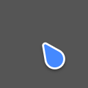<br><sub>default</sub> | 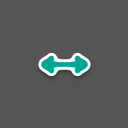<br><sub>ew-resize</sub> |
| <br><sub>grabbing</sub> | <br><sub>grab</sub> | 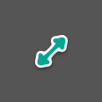<br><sub>nesw-resize</sub> | <br><sub>no-drop</sub> | <br><sub>not-allowed</sub> |
| 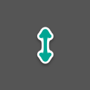<br><sub>ns-resize</sub> | 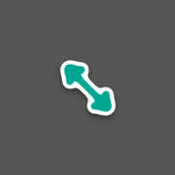<br><sub>nwse-resize</sub> | <br><sub>pointer</sub> | 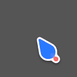<br><sub>progress</sub> | 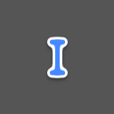<br><sub>text</sub> |
| 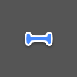<br><sub>vertical-text</sub> | <br><sub>wait</sub> | <br><sub>zoom-in</sub> | <br><sub>zoom-out</sub> | |

#### Transitions

| | | | | |
| --- | --- | --- | --- | --- |
| <br><sub>default / col-resize</sub> | <br><sub>default / crosshair</sub> | <br><sub>default / ew-resize</sub> | 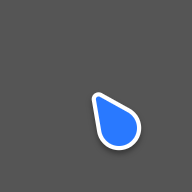<br><sub>default / grabbing</sub> | <br><sub>default / grab</sub> |
| <br><sub>default / nesw-resize</sub> | <br><sub>default / ns-resize</sub> | <br><sub>default / nwse-resize</sub> | <br><sub>default / pointer</sub> | <br><sub>default / progress</sub> |
| <br><sub>default / text</sub> | <br><sub>default / wait</sub> | <br><sub>grabbing / copy</sub> | <br><sub>grabbing / no-drop</sub> | 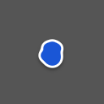<br><sub>grabbing / not-allowed</sub> |
| <br><sub>grab / grabbing</sub> | 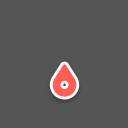<br><sub>pointer / text</sub> | 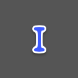<br><sub>text / vertical-text</sub> | <br><sub>zoom-in / zoom-out</sub> | |

## Layout

- `crates/core`: shape names and aliases, motion, color and paint helpers,
  the theme writer (Xcursor files, transition files, symlinks, GIF previews),
  the CLI, and the consistency checks every theme runs.
- `crates/dot`, `crates/fluid`, `crates/shapes`: one crate per theme. Each
  implements `cursor_core::Theme`: hotspots, cursor frames, transition frames
  and drawing.

A new theme is a crate with a `Theme` implementation, a three-line `main.rs`
calling `cursor_core::cli::run`, and a test calling `cursor_core::check::theme`.

The checks require exact hotspots at every size, transition endpoints identical
to the ordinary cursors, nothing clipped at the canvas edge, and working aliases.

## Build

```sh
nix build .#shapes                       # theme in result/share/icons
nix build .#dot
nix build .#fluid
nix build .#niri --out-link result-niri  # patched Niri 26.04
```

Locally:

```sh
nix develop
cargo test
cargo run --release -p shapes-cursors -- --output build/shapes --preview previews/shapes
cargo run --release -p dot-cursors -- --output build/dot --preview previews/dot
cargo run --release -p fluid-cursors -- --output build/fluid --preview previews/fluid
```

## Niri

Apply `patches/niri-cursor-transitions.patch` to Niri 26.04, then select a
theme with Home Manager's `home.pointerCursor` and in Niri:

```kdl
cursor {
    xcursor-theme "animated_shapes_cursors"
    xcursor-size 24
}
```

A transition is an ordinary animated Xcursor file named
`cursors/<from>-to-<to>` with Wayland cursor-shape names, 24 frames at 5 ms.
One file serves both directions, and shape aliases share it through symlinks.
Cursors are drawn 1.5 times their nominal size on canvases enlarged to match
(36 px at size 24), so they read like conventional themes. Transition frames
use a canvas twice that, centered on the hotspot.
Only applications using the cursor-shape protocol get transitions.
